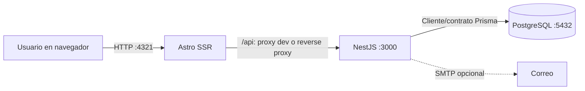

# Arquitectura del sistema

## Evolución del proyecto

La versión original estaba compuesta por backend Java/Spring Boot, frontend legacy HTML/CSS/JavaScript y PostgreSQL. La migración se realizó progresivamente: las funciones activas pasaron a una API NestJS y una aplicación Astro, manteniendo PostgreSQL como base de datos. JWT gestiona la sesión y BCrypt verifica/protege contraseñas.

Spring Boot, `pom.xml`, `mvnw` y los recursos web antiguos se conservan en el repositorio como referencia legacy y evidencia de migración. No son los servicios que se inician en la demo actual.

## Arquitectura actual

Astro presenta páginas y componentes por rol, utiliza un cliente HTTP centralizado, protege navegación con la sesión y adapta el sidebar a desktop/móvil. En desarrollo, las solicitudes `/api` se proxifican a NestJS mediante `PUBLIC_API_URL`. En producción se requiere un proxy inverso con HTTPS que enrute `/api`, o CORS limitado a los orígenes web autorizados. `PUBLIC_API_URL` no debe contener secretos.

NestJS organiza controladores, DTO/reglas de validación, servicios, guards y acceso a datos por dominio. El acceso PostgreSQL se realiza desde la API a través del cliente/contrato Prisma del repositorio. La API espera el esquema existente y no aplica migraciones al arrancar.

## Flujo de autenticación y autorización

1. El navegador envía las credenciales a `POST /api/auth/login`.
2. NestJS valida la cuenta activa y comprueba la contraseña mediante BCrypt; firma un JWT con vigencia de ocho horas.
3. Astro conserva la sesión necesaria para las peticiones, no la contraseña. Las solicitudes protegidas incluyen el token.
4. `JwtAuthGuard` valida la identidad y `RolesGuard` evalúa las restricciones declaradas en el controlador.
5. Los servicios validan además acceso al proyecto y al ticket, estado de compañías/proyectos y reglas propias de cada operación.
6. El frontend termina la sesión ante `401` y muestra acceso denegado ante `403`; ocultar una acción en la interfaz no concede permisos.

Los roles son `ADMIN`, `SUPERVISOR`, `AGENTE` y `CLIENTE`. ADMIN tiene alcance global para los módulos que administra. Los demás roles se limitan mediante asignaciones activas a proyectos y comprobaciones por ticket. Varias capacidades —como reportes, historial, creación de tickets y solicitudes de recursos— tienen banderas configurables por rol.

## Módulos principales

- **Identidad y seguridad:** autenticación, roles, guards y validación de alcance.
- **Administración:** usuarios, compañías, proyectos y asignaciones usuario/proyecto.
- **Tickets:** creación, listado, detalle, asignación, estado, prioridad y reglas de SLA.
- **Colaboración:** comentarios públicos/internos e historial automático.
- **Archivos:** metadata y almacenamiento local protegido de adjuntos.
- **Solicitudes de recursos:** seguimiento, fechas, estados y alertas de retraso.
- **Reportes:** resumen, distribuciones por estado/prioridad/tipo, métricas operativas y resumen de recursos con filtros/alcance.
- **Configuración y auditoría:** banderas operativas y registro transaccional de los cambios efectivos.
- **Enlaces compartidos:** creación/revocación protegida y lectura pública limitada.
- **Notificaciones:** envío SMTP opcional para eventos configurados.

## Tickets, comentarios e historial

Los tickets relacionan proyecto, cliente, agente asignado y tipo de incidencia; registran prioridad, estado y fechas. El backend restringe la creación, asignación, cambio de estado/prioridad y cierre según rol y acceso. El cierre requiere nota. Los tickets gestionan SLA de primera respuesta y resolución cuando sus fechas límite están configuradas; no existe una ruta independiente de reportes SLA.

Los comentarios se guardan relacionados al ticket, autor y fecha. `PUBLICO` e `INTERNO` se filtran según el rol; el cliente solo recibe comentarios públicos y no puede crear comentarios internos. Los eventos se agregan automáticamente al historial dentro de las operaciones que los producen; no hay edición manual del historial desde el frontend.

## Adjuntos

La API valida formato, extensión, nombre y límite de 10 MiB. Los archivos admitidos son PDF, DOC/DOCX, PNG, JPG/JPEG, TXT y XLS/XLSX. El almacenamiento usa un UUID más la extensión y mantiene la metadata asociada al ticket en PostgreSQL. La descarga exige acceso al ticket, verifica que la ruta real permanezca dentro de una carpeta autorizada y devuelve `404` cuando el archivo no existe o no se puede leer. El área de uploads queda fuera de Git y necesita política de respaldo y retención en el despliegue.

## Recursos externos y notificaciones

Las solicitudes de recursos se vinculan al ticket y conservan recurso, cantidad, proveedor, fechas y estado. Un proceso programado revisa entregas vencidas; la condición de retraso genera seguimiento/alerta, no cambia por sí misma el estado persistido. Al cerrar una solicitud, el servicio puede cerrar el ticket relacionado según las reglas. La edición de solicitudes está restringida a ADMIN/SUPERVISOR.

SMTP se activa solo cuando hay credenciales locales configuradas. Se usa en recuperación de contraseña y en notificaciones de tickets, comentarios, enlaces y recursos cuando corresponde. Los errores se capturan para no revertir operaciones de negocio soportadas; logs no deben incluir secretos.

## Reportes y configuración

Las rutas de reportes devuelven resúmenes de tickets, distribuciones por estado/prioridad/tipo, operación y recursos. Los filtros de compañía/proyecto se intersectan con el alcance real del usuario; una consulta sobre proyecto no autorizado se rechaza. No hay endpoint de SLA independiente.

La configuración administra banderas booleanas globales y por rol para creación de tickets, solicitudes de recursos, reportes e historial. La lectura requiere JWT; la actualización y consulta de auditoría están reservadas a ADMIN. Los campos se validan antes de escribir. Una actualización efectiva y sus registros de auditoría se escriben en una misma transacción; la auditoría guarda usuario, rol, módulo, fecha y valores anterior/nuevo.

## Enlaces compartidos

ADMIN/SUPERVISOR pueden crear, listar y revocar enlaces para tickets dentro de su alcance. La expiración predeterminada es siete días y el límite configurado es 30 días. No hay una operación separada de regeneración: crear otro enlace genera un token nuevo. La ruta pública `/api/public/compartidos/:token` no requiere JWT y devuelve un DTO de solo lectura con datos permitidos del ticket. No incluye correo del cliente, comentarios, historial, adjuntos, tokens de autenticación ni rutas internas. Las fechas de expiración y la revocación se validan al leer.

## Pruebas y operación

Las pruebas unitarias y HTTP/E2E de la API emplean fixtures y mocks; el setup de pruebas está configurado para no escribir en PostgreSQL ni enviar correo real. Las pruebas web usan Playwright y servicios de fixture. Comandos documentados: `npm run build`, `npm run check`, `npm run typecheck:api`, `npm run test:api`, `npm run test:api:e2e` y `npm run test:web:e2e`.

La API se ejecuta en el puerto `3000`, Astro en `4321` y PostgreSQL normalmente en `5432`. `8081` solo aparece como puerto histórico del frontend legacy y como fallback heredado al generar enlaces si `FRONTEND_URL` no está configurado; para la aplicación activa debe configurarse `FRONTEND_URL=http://localhost:4321`.
