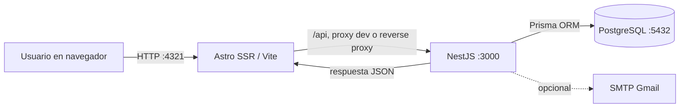

# Arquitectura

## Evolución

La arquitectura anterior combina backend Spring Boot/Java (capas controller, service, repository y entity), frontend HTML/CSS/JavaScript servido como recursos estáticos y PostgreSQL. Esa implementación permanece en el repositorio como legacy y referencia funcional.

La arquitectura activa del monorepo es NestJS + Astro + PostgreSQL. NestJS contiene módulos REST por dominio y utiliza TypeScript y Prisma ORM PostgreSQL con un contrato del esquema existente. Astro entrega páginas SSR con Node y consume la API mediante `/api`. No se inicia Spring Boot para la demo Astro.

## Flujo de petición

En desarrollo, Astro configura el proxy Vite para `/api`, apuntando a `PUBLIC_API_URL`. Para despliegue, Astro SSR y API deben estar detrás de un reverse proxy con HTTPS que dirija `/api` a NestJS, o la API debe permitir CORS únicamente para el origen web esperado. `PUBLIC_API_URL` queda incorporada en la configuración de build de Astro y no puede contener secretos.

## Autenticación y autorización

1. El cliente envía credenciales a `POST /api/auth/login`.
2. La API valida identidad y hash BCrypt y devuelve un JWT firmado con `JWT_SECRET` (8 horas).
3. El frontend guarda únicamente la sesión necesaria en `sessionStorage`; no conserva contraseña.
4. Las solicitudes protegidas incluyen el JWT. `JwtAuthGuard` valida identidad y `RolesGuard` valida roles.
5. Servicios de dominio aplican además límites por compañía/proyecto/ticket. El backend es autoridad final: un control oculto en UI no concede acceso.
6. `401` invalida la sesión en la web; `403` representa acceso denegado.

Roles principales: ADMIN, SUPERVISOR, AGENTE y CLIENTE. El alcance y operaciones concretas se definen en controladores, guards y servicios de cada módulo.

## Módulos de API

`auth`, `usuarios`, `roles`, `companias`, `proyectos`, `administracion` (asignaciones), `tickets`, `comentarios`, `historial-tickets`, `adjuntos`, `solicitudes-recursos`, `reportes`, `configuracion`, `enlaces-compartidos`, `notificaciones` y `security`.

## Datos, adjuntos y tareas

La API persiste en el esquema PostgreSQL existente mediante el cliente ORM y contrato ubicado en `apps/api/src/prisma/`. La aplicación no ejecuta migraciones automáticamente. Los adjuntos se almacenan fuera del control de versiones en el área local de uploads y su metadata se relaciona con tickets; respaldos/retención del almacenamiento se deben configurar para el despliegue.

Las notificaciones SMTP son opcionales. Sin `MAIL_USERNAME` y `MAIL_PASSWORD`, el transporte no se crea. Los errores de correo no deben exponer credenciales y no bloquean operaciones de negocio previstas para continuar sin correo. Un job interno revisa solicitudes de recursos retrasadas según intervalos configurables.

## Auditoría y enlaces

Los cambios de configuración permitidos generan registros de auditoría consultables por roles autorizados; no existe escritura manual desde la interfaz. El historial de ticket mantiene trazabilidad de eventos del ticket.

Los enlaces compartidos son generados/revocados desde rutas protegidas (ADMIN/SUPERVISOR, con alcance del proyecto). La lectura pública pasa por `/api/public/compartidos/:token`, no requiere JWT y devuelve un DTO limitado. No debe mostrar correo, token, rutas internas, comentarios, historial ni adjuntos.

## Seguridad operacional

- Usa secretos aleatorios por entorno, variables locales fuera de Git y credenciales PostgreSQL de mínimo privilegio.
- Sirve tráfico externo con HTTPS y limita CORS/orígenes.
- Conserva `uploads/` fuera de Git y aplica controles de acceso, tamaño y respaldos apropiados.
- Evita exponer tokens o registros con datos personales en logs/capturas de demo.
- Las suites automatizadas están configuradas con fixtures y mocks y bloquean acceso a PostgreSQL/SMTP reales.
